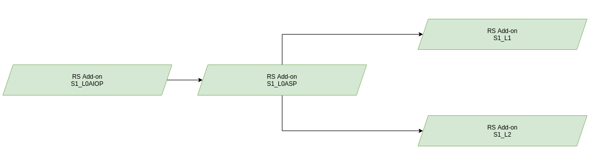

# production-sentinel1

:arrow_heading_up: Go back to the [Reference System Software repository](https://github.com/COPRS/reference-system-software) :arrow_heading_up:

# Installation Manual

## Acroynms

| Abbreviation | Definition |
|---|---|
| AIOP | All-In-One-Processor |
| ASP | Assembling Slicing Processor |
| COPRS | Copernicus Reference System |
| CPU | Central Processing Unit
| DB | Database |
| EDRS | European Data Relay Satellite |
| IPF | Instrument Processing Facility |
| L0 | Level-0 |
| L1 | Level-1 |
| L2| Level-2|
| RAM | Random Access Memory |
| RS | Reference System |
| S1 | Sentinel-1 |
| SCDF | Spring Cloud Dataflow |
| SpEL | Sprint Expression Language |
| OBS | Object Storage |

## Overview

Within this repository you can find the RS Add-ons the for the Sentinel-1 mission. Each RS-Add-on contains a mission specific workflow that can be deployed on its own and adding the processing preparation as well as the scientific processor that processes the satellite data.

The following figure provides an overview about how the different RS Add-ons are chained into each other when all are deployed:

The S1 AIOP processor consumes EDRS Sessions are producing L0 Segment files from it. The S1 ASP is using these segments to produce L0 Slices from it. The S1 L1 and L2 processor are using these slices to produce higher level products.

The following individual processing chains are available:
* [S1 AIOP](./s1-l0aiop/doc/ReleaseNote.md)
* [S1 ASP](./s1-l0asp/doc/ReleaseNote.md)
* [S1 L1](./s1-l1/doc/ReleaseNote.md)
* [S1 L2](./s1-l2/doc/ReleaseNote.md)

For more information, please consult [https://sentinels.copernicus.eu/web/sentinel/missions/sentinel-1](https://sentinels.copernicus.eu/web/sentinel/missions/sentinel-1)