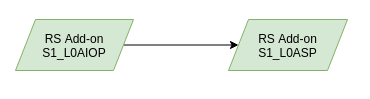

:arrow_heading_up: Go back to the [Reference System Software repository](https://github.com/COPRS/reference-system-software) :arrow_heading_up:

# Processing Sentinel-1

- [Processing Sentinel 1](#processing-sentinel-1)
  - [Overview](#overview)
  - [Available RS Addons](#available-rs-addons)
  - [Dependencies](#dependencies)
  - [Deployment](#deployment)
  - [Acroynms](#acroynms)

## Overview

Within this repository you can find the RS Add-ons the for the Sentinel-1 mission. Each RS-Add-on contains a mission specific workflow that can be deployed on its own and adding the processing preparation as well as the scientific processor that processes the satellite data.

The following figure provides an overview about how the different RS Add-ons are chained into each other when all are deployed:



The S1 AIOP processor consumes EDRS Sessions are producing L0 Segment files from it. The S1 ASP is using these segments to produce L0 Slices from it.

## Available RS Addons

The following individual processing chains are available:

- [S1 AIOP](./s1-l0aiop/doc/ReleaseNote.md)
- [S1 ASP](./s1-l0asp/doc/ReleaseNote.md)

For more information, please consult [https://sentinels.copernicus.eu/web/sentinel/missions/sentinel-1](https://sentinels.copernicus.eu/web/sentinel/missions/sentinel-1)

Please note that each of the RS Add-ons are using a generic set of microservices. The available configuration parameters are not described in the RS Add-on directly, but can be found in a [common documentation](./docs/common/README.md) that is applicable for all the RS add-ons listed above. Please consult it in order to learn what configuraton parameters are available.

## Dependencies

In order to work properly the RS Add-ons are requiring a few dependencies that needs to be deployed before hands.

**Infrastructure Layer**

COPRS are using a set of technologies that are utilized by the components. E.g. Kafka, Elasticsearch and MongoDB needs to be available. This infrastructure layer needs to be installed first. For more information on its installation, please consult this [repository](https://github.com/COPRS/infrastructure).

**RS Core Components**
The chain itself will not work without other RS Core components. At least the a Ingestion Chain (for retrieving inputs) and Metadata Extraction (for extracting metadata) needs to be deployed to the cluster. It is also highly recommended to deploy the DLQ as well for a proper error handling.

You can find more information and installation instructions in this [repository](https://github.com/COPRS/production-common).

## Deployment

Each RS Add-on contains a description about the services for the specific processing chain that shall be deployed into the cluster as well as a reference to the docker images that shall be used and a factory default configuration.

In order to deploy a RS Add-on the Ansible scripts from the [infrastructure repository](https://github.com/COPRS/infrastructure) can be used. The following Add-Ons are available for deployment:

```
ansible-playbook deploy-rs-addon.yaml \
    -i inventory/mycluster/hosts.ini \
    -e rs_addon_location=https://artifactory.coprs.esa-copernicus.eu/artifactory/rs-zip-private/rs-addons/s1/RS_ADDON_S1-L0ASP_<VERSION>.zip \
    -e stream_name=S1_L0ASP
```

```
ansible-playbook deploy-rs-addon.yaml \
    -i inventory/mycluster/hosts.ini \
    -e rs_addon_location=https://artifactory.coprs.esa-copernicus.eu/artifactory/rs-zip-private/rs-addons/s1/RS_ADDON_S1-L0AIOP_<VERSION>.zip \
    -e stream_name=S1_L0AIOP
```

```
ansible-playbook deploy-rs-addon.yaml \
    -i inventory/mycluster/hosts.ini \
    -e rs_addon_location=https://artifactory.coprs.esa-copernicus.eu/artifactory/rs-zip-private/rs-addons/s1/RS_ADDON_S1-L1_<VERSION>.zip \
    -e stream_name=S1_L1
```

```
ansible-playbook deploy-rs-addon.yaml \
    -i inventory/mycluster/hosts.ini \
    -e rs_addon_location=https://artifactory.coprs.esa-copernicus.eu/artifactory/rs-zip-private/rs-addons/s1/RS_ADDON_S1-L2_<VERSION>.zip \
    -e stream_name=S1_L2
```

For further information on using the deployment script, please consult its [manual](https://github.com/COPRS/infrastructure/blob/e642b4e78782b3e5d649570e4a72b27cb42efeed/doc/how-to/RS%20Add-on%20-%20RS%20Core.md).

## Acroynms

| Abbreviation | Definition                     |
| ------------ | ------------------------------ |
| AIOP         | All-In-One-Processor           |
| ASP          | Assembling Slicing Processor   |
| COPRS        | Copernicus Reference System    |
| CPU          | Central Processing Unit        |
| DB           | Database                       |
| EDRS         | European Data Relay Satellite  |
| IPF          | Instrument Processing Facility |
| L0           | Level-0                        |
| L1           | Level-1                        |
| L2           | Level-2                        |
| RAM          | Random Access Memory           |
| RS           | Reference System               |
| S1           | Sentinel-1                     |
| SCDF         | Spring Cloud Dataflow          |
| SpEL         | Sprint Expression Language     |
| OBS          | Object Storage                 |
