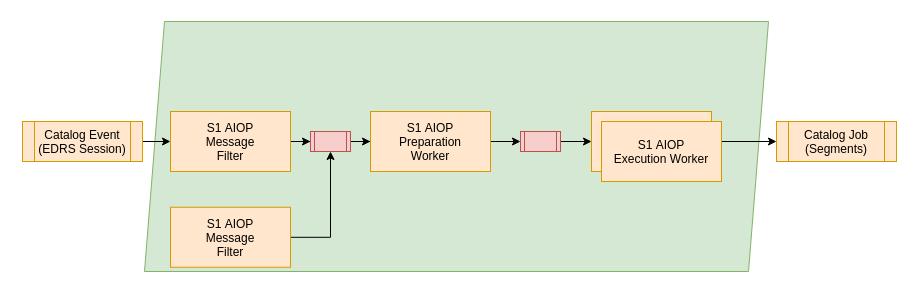

:arrow_heading_up: Go back to the [Reference System Software repository](https://github.com/COPRS/reference-system-software) :arrow_heading_up:

# RS Add-on S1 L0 AIOP
 
 * [RS Add-on S1 L0 AIOP](#rs-add-on-s1-l0-aiop)
    * [Overview](#overview)
    * [Requirements](#requirements)
    * [Additional Resources](#additional-resources)
    * [Deployment Prerequisite](#deployment-prerequisite)

## Overview

The chain will start from the topic catalog event and watching out for new messages there. The message filter will ensure that just EDRS sessions and related auxiliary files are consumed by the chain. All other product types will be discard and no processing occurs. Just if the request is not filtered it will be send to the Preparation worker. Its major task is to ensure that all required products for a production are available. According to the task table of the AIOP it will check if all required auxiliary files can be found in the catalog via the Metadata Search Controller. Additionally it will verify that all required chunks of the session are ingested into the catalog already as well.

If the production is not ready yet the request will be persisted and discarded. Once a new relevant product for the chain arrives, it will check again if all required input products are available. When all suitable products are available the job order will be generated and send to the execution worker. Note that after the Preparation Worker there are three chains available that are gated by a priority filter that allows to split the request regarding their priority on different groups of execution workers. This can be used to prioritize certain types of request.

The execution chains does handle three different priorities:

* High
* Medium
* Low

These can be used to honor the different requirements on timeliness. Each priority will have a filter that can be configured to determine the priority of the incoming event and decide which priority will be responsible for performing the processing. It is possible to scale the different worker priorities individually as it might be required to spawn more workers for the high priorities than for the lower ones.

For details, please see the applicable [Processing Chain Design](https://github.com/COPRS/production-common/blob/main/docs/architecture/README.md#processing)

## Requirements

This software does have the following minimal requirements:

| Resource                    | Execution Worker* |
|-----------------------------|-------------|
| CPU                         | 7000m       |
| Memory                      | 50Gi        |
| Disk volume needed          | yes         |
| Disk access                 | ReadWriteOnce |
| Disk storage capacity       | 220Gi **    |
| Affinity between Pod / Node | N/A         |
|                             |             |

* These resource requirements are applicable for one worker. There may be many instances of workers, see scaling up workers for more details.
** This amount had been used in previous operational S1 environment. The disk size might be lower depending on the products that are processed. This needs to be at least twice of the product size of the biggest product. An additional margin of 10% is recommended however.

## Additional Resources 

The preparation worker needs the task table for the IPF wrapped inside of the execution worker. To provide the preparation worker with the needed task table, a configmap will be created by the deployment script based on the file ``tasktable_configmap.yaml``. The resulting configmap contains the task table needed for the S1 AIOP preparation worker, in order to create compatible job orders. 

The config map will be created in kubernetes in the processing namespace and will be named ``s1-l0aiop-tasktables``, to be distinguishable from other tasktable configmaps.

## Deployment Prerequisite

In order to operate this RS add-on there are some dependencies that needs to be deployed beforehand. For additional information, please consult the [common configuration](common/README.md#deployment-prerequisite).

## Configuration

The RS add-on is using a set of generic microservices from the RS Core. The configuration of these configuration parameters are not given within this document, but can be found in the [common documentation](/common/README.md) that is applicable for all RS add-ons.

There are no specific configurations existing for this RS add-on.